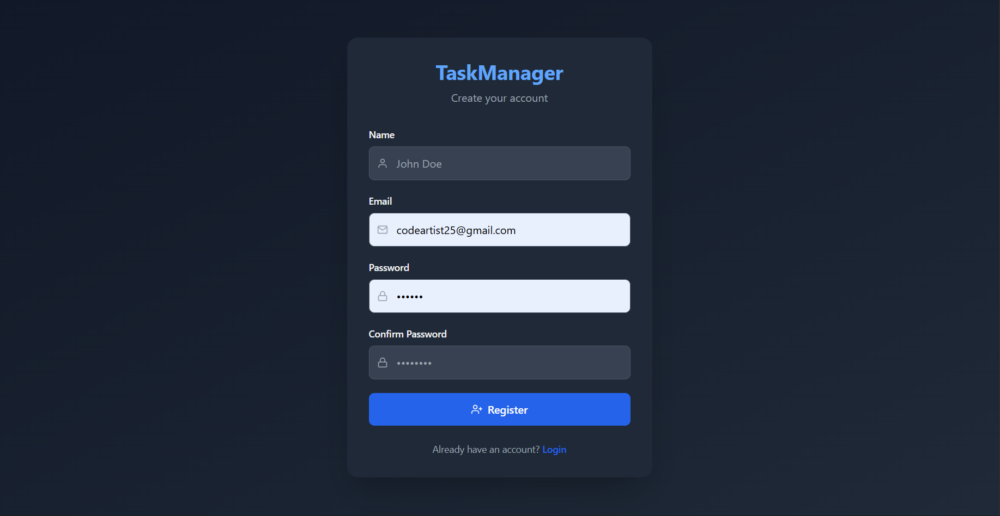
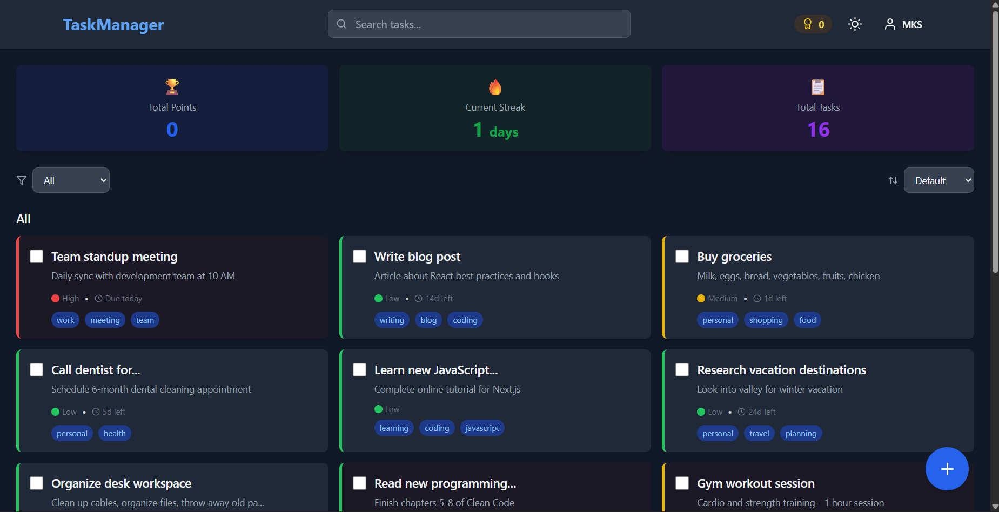
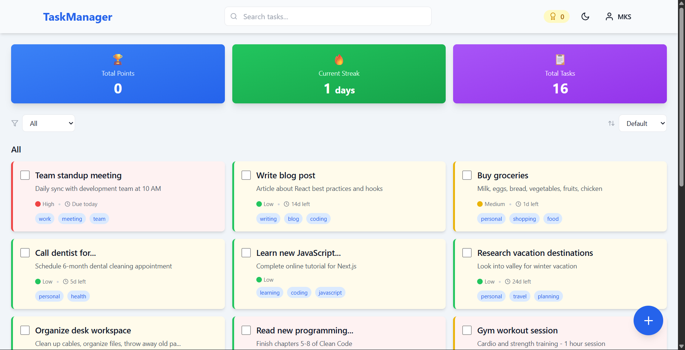
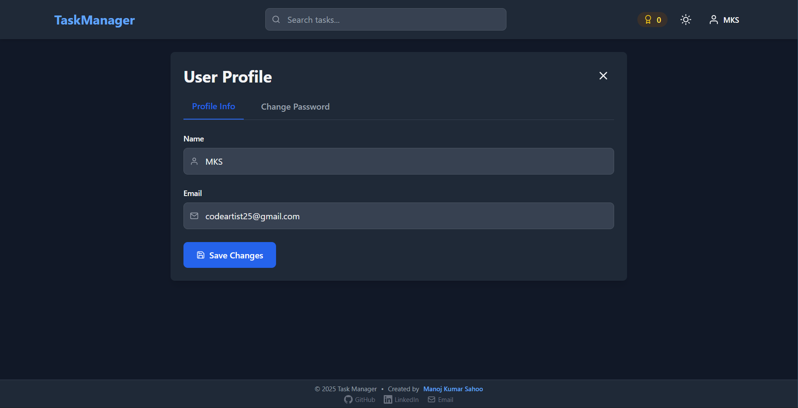
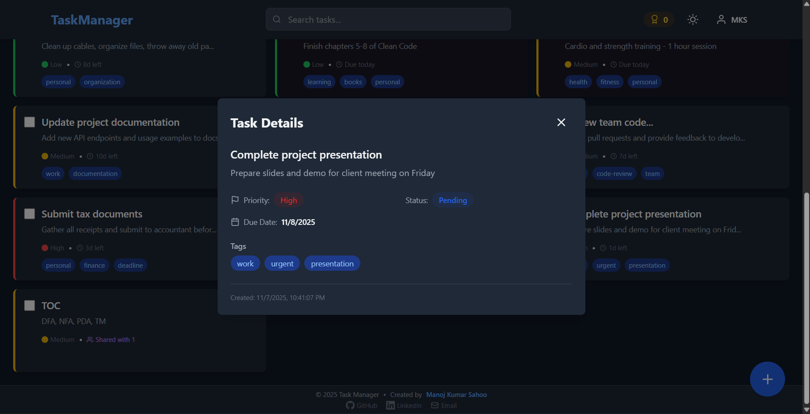
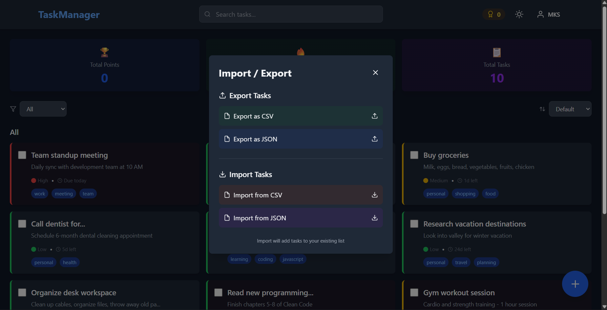

<div align="center">

# 📋 Task Manager

### A Modern, Full-Featured Task Management Application

**🚀 [Live Demo](https://mks-task-manager.vercel.app/) | 📖 [Documentation](#-documentation) | 🐛 [Report Bug](https://github.com/Manoj-Sahoo-536/Task-Manager/issues)**

</div>

---

## 🌟 Overview

Task Manager is a powerful, feature-rich task management application designed to boost productivity through intelligent task organization, gamification, and seamless collaboration. Built with modern web technologies, it offers a smooth, responsive experience across all devices.

### ✨ Key Highlights

- 🎯 **Smart Task Management** - Intuitive drag-and-drop interface with advanced filtering
- 🎮 **Gamification** - Earn points, maintain streaks, unlock badges
- 👥 **Collaboration** - Share tasks and collaborate with team members
- 📱 **PWA Support** - Install as a native app, works offline
- 🎨 **Customizable Themes** - 6 beautiful color themes + dark mode
- 🎤 **Voice Input** - Create tasks using natural language
- 📊 **Analytics Dashboard** - Track productivity and insights
- 🔄 **Recurring Tasks** - Automate repetitive tasks
- 📎 **File Attachments** - Attach documents, images, and files
- 📥 **Import/Export** - Backup and migrate data easily

---

## 🚀 Demo

> **Try it live:** [https://mks-task-manager.vercel.app/](https://mks-task-manager.vercel.app/)

> **View Screenshots:** [See all screenshots](#-screenshots)

---

## 🛠️ Tech Stack

<div align="center">

### Frontend


### Backend


</div>

**Frontend:** React, Vite, Tailwind CSS, Material-UI, Framer Motion, @hello-pangea/dnd  
**Backend:** Node.js, Express, MongoDB, Mongoose, JWT, Multer  
**Tools:** Git, npm, Postman

---

## 🎯 Features

### Core Functionality
- ✅ **Complete CRUD Operations** - Create, read, update, delete tasks
- 🔍 **Advanced Search & Filters** - Find tasks instantly
- 🏷️ **Tags & Categories** - Organize with custom tags
- ⭐ **Priority Levels** - High, medium, low priority
- 📅 **Due Dates & Reminders** - Never miss a deadline
- ✔️ **Bulk Operations** - Complete or delete multiple tasks

### Advanced Features
- 🔄 **Recurring Tasks** - Daily, weekly, monthly schedules
- 📎 **File Attachments** - Upload up to 5 files per task
- 👥 **Task Sharing** - Collaborate with other users
- 📊 **Analytics Dashboard** - Productivity insights and trends
- 🏆 **Gamification System** - Points, streaks, badges, leaderboard
- ⏮️ **Task History & Undo** - Track changes and restore tasks
- 🎤 **Voice Input** - Create tasks with speech recognition
- 📥 **Import/Export** - CSV and JSON support
- 🎨 **Custom Themes** - 6 color themes + dark/light mode
- 📱 **PWA & Offline Mode** - Works without internet

### User Experience
- 🔐 **Secure Authentication** - JWT-based auth system
- 👤 **User Profiles** - Manage account and view stats
- 🌙 **Dark Mode** - Easy on the eyes
- 📱 **Fully Responsive** - Works on all devices
- 🎨 **Beautiful UI** - Modern, clean design
- ⚡ **Fast & Optimized** - Smooth performance

---

## 📦 Installation

### Prerequisites
- Node.js (v14 or higher)
- MongoDB (local or Atlas)
- npm or yarn

### Clone Repository
```bash
git clone https://github.com/Manoj-Sahoo-536/task-manager.git
cd task-manager
```

### Backend Setup
```bash
cd backend
npm install

# Create .env file
cat > .env << EOF
PORT=5000
MONGODB_URI=mongodb://localhost:27017/taskmanager
JWT_SECRET=your_super_secret_jwt_key_here
NODE_ENV=development
EOF

# Start backend server
npm run dev
```

### Frontend Setup
```bash
cd frontend
npm install

# Create .env file
cat > .env << EOF
VITE_API_URL=http://localhost:5000/api
EOF

# Start frontend
npm run dev
```

Visit `http://localhost:5173` to see the app running locally.

---

## 🔧 Configuration

### Environment Variables

#### Backend (.env)
```env
PORT=5000
MONGODB_URI=mongodb://localhost:27017/taskmanager
JWT_SECRET=your_jwt_secret_key
NODE_ENV=development
```

#### Frontend (.env)
```env
VITE_API_URL=http://localhost:5000/api
```

---

## 📖 API Documentation

### Authentication
| Method | Endpoint | Description |
|--------|----------|-------------|
| POST | `/api/auth/register` | Register new user |
| POST | `/api/auth/login` | Login user |
| GET | `/api/auth/me` | Get current user |
| POST | `/api/auth/logout` | Logout user |

### Tasks
| Method | Endpoint | Description |
|--------|----------|-------------|
| POST | `/api/tasks` | Create task |
| GET | `/api/tasks` | Get all tasks (with filters) |
| GET | `/api/tasks/:id` | Get single task |
| PUT | `/api/tasks/:id` | Update task |
| DELETE | `/api/tasks/:id` | Delete task |
| PATCH | `/api/tasks/:id/complete` | Toggle completion |
| POST | `/api/tasks/bulk-complete` | Bulk complete tasks |
| DELETE | `/api/tasks/bulk-delete` | Bulk delete tasks |

### Advanced
| Method | Endpoint | Description |
|--------|----------|-------------|
| POST | `/api/tasks/:id/attachments` | Upload attachments |
| GET | `/api/tasks/search` | Search tasks |
| POST | `/api/tasks/:id/recurring` | Setup recurring task |
| POST | `/api/tasks/:id/share` | Share task with user |
| GET | `/api/tasks/:id/history` | Get task history |

### Analytics
| Method | Endpoint | Description |
|--------|----------|-------------|
| GET | `/api/analytics/overview` | Task statistics |
| GET | `/api/analytics/productivity` | Productivity trends |
| GET | `/api/analytics/streaks` | User streaks |

### Import/Export
| Method | Endpoint | Description |
|--------|----------|-------------|
| GET | `/api/export/csv` | Export tasks to CSV |
| GET | `/api/export/json` | Export tasks to JSON |
| POST | `/api/import/csv` | Import tasks from CSV |
| POST | `/api/import/json` | Import tasks from JSON |

---

## 📱 Usage

### Creating a Task
1. Click the **"+ Add Task"** button
2. Fill in task details (title, description, priority, due date)
3. Add tags, attachments, or set as recurring
4. Click **"Create Task"**

### Voice Input
1. Click the microphone icon
2. Say your task naturally: *"High priority meeting tomorrow at 3pm with work tag"*
3. The app will parse and create the task automatically

### Collaboration
1. Open any task
2. Click **"Share"** button
3. Search for users by email
4. Select users to share with

### Offline Mode
- The app automatically caches data for offline use
- Create and edit tasks without internet
- Changes sync automatically when back online

---

## 🎨 Screenshots

<div align="center">

### Registration & Login


### Dashboard


### White Mode


### User Profile


### Task Details


### Share Task


### Task History


### Import/Export


</div>

---

## 🚀 Deployment

The application is deployed and live at: **[https://mks-task-manager.vercel.app/](https://mks-task-manager.vercel.app/)**

### Deploy Your Own

#### Backend (Render/Railway/Heroku)
1. Create new web service
2. Connect your repository
3. Set environment variables
4. Deploy

#### Frontend (Vercel/Netlify)
1. Import repository
2. Set build command: `npm run build`
3. Set output directory: `dist`
4. Add environment variables
5. Deploy

---

## 📚 Documentation

- [API Reference](docs/API_REFERENCE.md) - Complete API documentation
- [User Guide](docs/USER_GUIDE.md) - How to use the application
- [Deployment Guide](docs/DEPLOYMENT.md) - Deploy to production
- [Contributing Guide](docs/CONTRIBUTING.md) - How to contribute

---

## 🤝 Contributing

Contributions are welcome! Please follow these steps:

1. Fork the repository
2. Create a feature branch (`git checkout -b feature/AmazingFeature`)
3. Commit your changes (`git commit -m 'Add some AmazingFeature'`)
4. Push to the branch (`git push origin feature/AmazingFeature`)
5. Open a Pull Request

---

## 🐛 Bug Reports

Found a bug? Please open an issue with:
- Bug description
- Steps to reproduce
- Expected vs actual behavior
- Screenshots (if applicable)

---

## 📝 License

Copyright © 2025 Manoj Kumar Sahoo. All Rights Reserved.

This project is licensed under the ISC License - see the [LICENSE](LICENSE) file for details.

---

## 👨‍💻 Author

**Manoj Kumar Sahoo**
- GitHub: [@Manoj-Sahoo-536](https://github.com/Manoj-Sahoo-536)
- LinkedIn: [manoj-kumar-sahoo-mks/](https://www.linkedin.com/in/manoj-kumar-sahoo-mks/)
- Email: manojsahoo8940@gmail.com

---

## 🙏 Acknowledgments

- Icons by [React Icons](https://react-icons.github.io/react-icons/)
- UI Components by [Material-UI](https://mui.com/)
- Animations by [Framer Motion](https://www.framer.com/motion/)

---

<div align="center">

### ⭐ Star this repository if you find it helpful!

Made with ❤️ by Manoj Kumar Sahoo

---

**Copyright © 2025 Manoj Kumar Sahoo. All Rights Reserved.**

Licensed under the ISC License | [View License](LICENSE)

</div>
